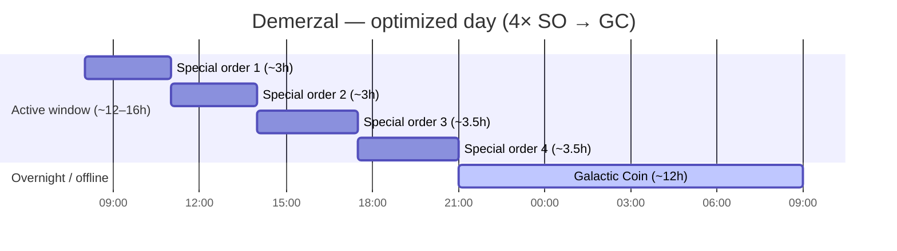
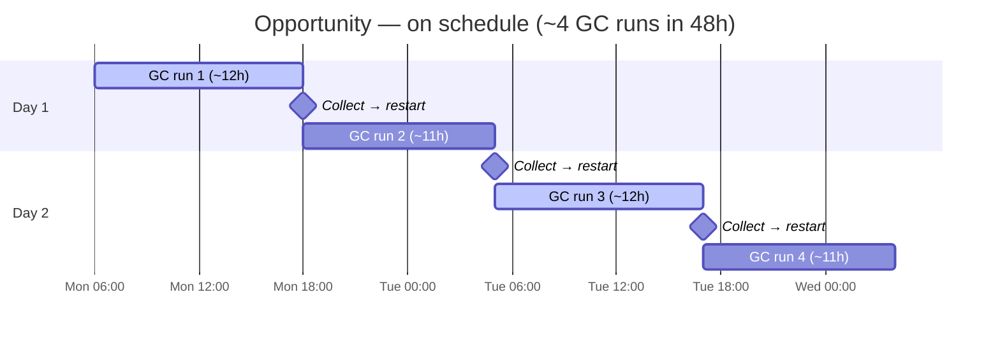
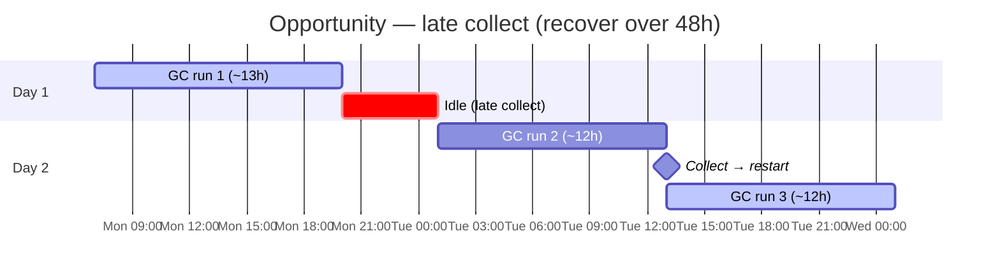
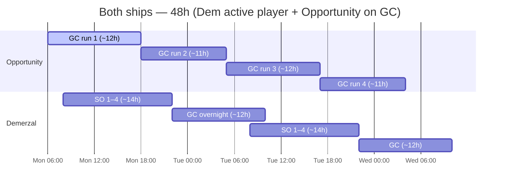

> **Machine translation (es).** English source: [optimized-pattern.md](../../optimized-pattern.md). Report fixes in guild chat or a GitHub issue.

# Patrón comercial optimizado

Estándar del gremio para envíos comerciales **Oportunidad** y **Demerzal (Dem)**.

---

## Reglas básicas

### Oportunidad: solo moneda galáctica

**La oportunidad solo debería ejecutar Galactic Coin (GC).**

- No asignar pedidos especiales a Opportunity
- **La bonificación de carga de la oportunidad favorece a GC**: ejecutar Galactic Coin exclusivamente es la forma preferida de usar esta nave
- Esa bonificación de carga **no parece aplicarse a pedidos especiales** (pruebas en el juego hasta ahora), por lo que SO en Opportunity desperdicia la principal ventaja del barco.
- El juego ofrece **3 ventanas de GC por día**; cada ejecución dura **~11 a 13 horas**
- Una sola carrera de GC puede ocupar la mayor parte de un día de vigilia; no asumas que puedes encadenar tres carreras completas en 24 horas
- **Planifique en un horizonte de 48 horas**: de manera realista, **~1 o 2 ejecuciones completadas por día**, **~3 a 4 en 48 horas** si recoge a tiempo
- El trabajo de Opportunity es **tiempo de actividad máximo de GC**, no rendimiento de pedidos especiales

#### ¿Por qué solo GC?

Opportunity tiene una **bonificación de carga** ligada a la cantidad de carga que transporta el barco en un recorrido. En las rutas de Galactic Coin, esa bonificación aumenta significativamente el pago, por lo que el estándar del gremio es **solo GC, siempre**, para acumular bonificación de carga en cada carrera.

Los pedidos especiales en Opportunity son una doble pérdida: pierdes el bono de carga GC en el barco construido para él, y **el bono de carga no parece aumentar las recompensas de pedidos especiales** de todos modos. Poner órdenes especiales a los demócratas; mantenga Opportunity en GC.

*Si un parche cambia la forma en que la bonificación de carga interactúa con los pedidos especiales, actualice este documento.*

### Demerzal — Pedidos especiales, luego Galactic Coin

**Dem ejecuta pedidos especiales durante su ventana activa, luego Galactic Coin.**

Dos modos válidos:

| Modo | Cuando | Patrón |
|------|------|---------|
| **Día activo** | Te registras regularmente | 4× pedidos especiales → Ejecución de GC |
| **Suspender/sin conexión** | Durante la noche o fuera | Solo moneda galáctica (igual que Opportunity inactiva) |

Dem es el **barco de pedido especial**. La oportunidad es el **barco GC**. No intercambies roles.

---

## Calendario: pedidos especiales (demócratas)

Dem tiene **4 espacios para pedidos especiales** por ciclo.

| Métrica | Valor |
|--------|--------|
| Pedidos especiales por ciclo | **4** |
| Tiempo por pedido especial | **2h 30m – 4h** (varía según pedido) |
| Los 4 en una ventana | **~12–16 horas** en total |
| Carrera de monedas galácticas | **~11–13 horas** |

**El día optimizado:** coloque los 4 pedidos especiales dentro de un período activo de 12 a 16 horas, luego comience una **ejecución de GC (~11 a 13 h)** antes de acostarse o antes de su próximo check-in.

---

## Horarios de muestra

Ajuste las horas de inicio a su zona horaria y hábitos de registro.

### Dem: jugador activo (registro ~3× día)

| Hora | demócratas |
|------|-----|
| Mañana | Iniciar pedido especial 1 |
| Mediodía | Recoger → pedido especial 2 (o 2 + 3 si son cortos) |
| Tarde | Recoger → pedidos especiales 3 + 4 |
| Antes de dormir | Inicio **Moneda Galáctica** (~11–13 horas durante la noche) |

Despiértese con GC completo; inicie el ciclo de pedidos especiales nuevamente o ejecute GC en Opportunity.

### Dem: solo modo de suspensión

Si no tocas el juego durante más de 8 horas:

- **Omitir pedidos especiales**: inicie **Galactic Coin** en Dem antes de desconectarse
- Reanude el ciclo de pedidos especiales cuando regrese durante un período de 12 a 16 horas

### Oportunidad — 3 ventanas, plan de 48 horas

El juego ofrece **3 ventanas de GC por día calendario**. Cada ejecución de Galactic Coin dura **~11 a 13 horas**, lo suficiente como para que normalmente completes **1 o 2 ejecuciones en 24 horas**, no las 3. Objetivo: **Oportunidad siempre en GC**; recopile y reinicie en el momento en que finalice cada ejecución.

| Métrica | Valor |
|--------|--------|
| Ventanas de GC por día | **3** (tragamonedas para juegos) |
| Longitud del recorrido del GC | **~11–13 horas** |
| Realista por 24h | **~1–2 ejecuciones completadas** |
| Realista por 48h | **~3–4 ejecuciones completadas** (según el cronómetro) |
| Horizonte de planificación | **48 horas** (dos días completos) |

**¿Por qué 48 horas?** A **11-13 h por recorrido**, una recogida tardía o una ruta larga pueden acabar con tu siguiente ventana. Un plan de un solo día fracasa. Mirando **dos días adelante** se muestra cuándo se registrará, dónde se superponen las ejecuciones y cuándo debe reiniciar inmediatamente para evitar tiempos de inactividad.

### Plazos de 48 horas

Los horarios son ilustrativos: cambie a su zona horaria y hábitos de registro. Cada bloque de GC dura **~11–13 h**.

#### Oportunidad: según lo previsto (~4 ejecuciones/48 h)

Recopile y reinicie inmediatamente después de cada ejecución. Dos ejecuciones por día calendario cuando el tiempo es ajustado.

#### Oportunidad: recogida tardía (~2–3 ejecuciones/48 h)

Un día lento; recupérese el día 2 reiniciando en el momento en que el barco esté libre; no espere un check-in "conveniente".

#### Ambos barcos: Dem activo + Oportunidad siempre GC

La oportunidad nunca detiene a GC. Dem ejecuta pedidos especiales durante su ventana activa, luego GC durante la noche.

| Ventana | Oportunidad |
|--------|-------------|
| Cada uno de los 3 espacios diarios de GC | **Galactic Coin** — reinicia tan pronto como se complete la ejecución anterior |
| Nunca | Pedidos especiales |
| Al planificar | Marque sus próximos **2 registros** (48 h): los recorridos son de **11 a 13 h** cada uno |

Si Dem ejecuta GC durante la noche, Opportunity **ya debería estar en GC** o iniciar el siguiente GC tan pronto como se complete el anterior; no habrá tiempo de inactividad en ninguno de los barcos de GC.

---

## Objetivo de 24 horas (demócrata) + objetivo de 48 horas (oportunidad)

**Dem**: un ciclo activo por día cuando sea posible (consulte el cronograma de **Ambos barcos** arriba).

**Oportunidad** — **~11–13 h por carrera**; **~1–2 carreras cada 24 h**, **~3–4 durante 48 h** con temporizador (consulte los cronogramas arriba).

| Escenario | Carreras / 24h | Carreras / 48h |
|----------|------------|------------|
| A tiempo | ~2 | ~3–4 |
| Recogida tardía | ~1 | ~2–3 (recuperación del día 2) |

**Pedidos especiales (SO)** = Solo para demócratas, durante el horario activo.  
**Moneda Galáctica (GC)** = Oportunidad siempre (3× ventanas diarias); Dem llena los vacíos y de la noche a la mañana.

---

## Lista de verificación

### Oportunidad
- [] Solo se asigna Galactic Coin: verifique antes de cada envío
- [] No hay pedidos especiales en este barco, nunca.
- [] Mantenga Opportunity en GC siempre que haya un espacio libre: **siempre en ejecución, nunca inactivo**
- [ ] Espere **~1 a 2 carreras completadas por día** (~11 a 13 h cada una); planifique **48 h** para **~3–4 carreras**
- [ ] Planifique los registros **con 48 horas de anticipación**: un retiro tardío le cuesta una ventana completa
- [] Recoge GC en el temporizador; reinicie inmediatamente: la oportunidad inactiva es un rendimiento desperdiciado

### Demerzal
- [] 4 pedidos especiales en cola durante el período activo de 12 a 16 horas cuando sea posible
- [ ] Después de completar el 4º pedido especial → iniciar **GC (~11–13h)** antes de desconectarse
- [ ] Si duerme más de 8 horas sin registros → **Solo GC**, omita los pedidos especiales
- [] Nunca dejes Dem inactivo entre ejecuciones si hay un espacio disponible

---

## Errores comunes

| Error | Arreglar |
|---------|-----|
| Pedidos especiales en Oportunidad | Mover todo SO a Dem: la bonificación de carga de Opp es para **GC** y no parece ayudar a SO |
| Dem inactivo durante la noche sin GC | Inicie GC (~11–13 h) antes de dormir |
| Se esperan 3 carreras completas de GC en un día | Las carreras son **11–13h**; en realidad, **1–2/día**, **~3–4/48h** |
| Las ejecuciones de GC supuestas son de ~8 a 10 h | Las ventanas son **de 11 a 13 h**: vuelva a planificar en un horizonte de 48 h |
| Solo 2 o 3 pedidos especiales por día en diciembre | Planifique un período de 12 a 16 horas para los 4 |
| GC en Dem mientras estás activo y espacios SO abiertos | Ejecute SO primero, GC al final en la ventana |
| Ambos barcos en pedidos especiales | Opp nunca ejecuta SO: los demócratas son propietarios |

---

## Resumen

| Barco | Rol | Patrón |
|------|------|---------|
| **Oportunidad** | Especialista en GC | Moneda Galáctica **solo** — **bonificación de carga en GC**; Así que no parece beneficiarse |
| **Demerzal** | SO + GC flexible | 4× pedidos especiales (12–16 h) → GC (~11–13 h); o GC mientras duermes |

---

*Los tiempos son aproximados: confirma la duración del juego para tu servidor y actualiza este documento si los parches cambian la duración de ejecución.*