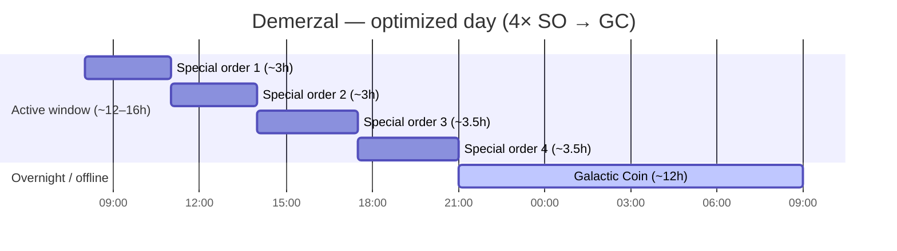
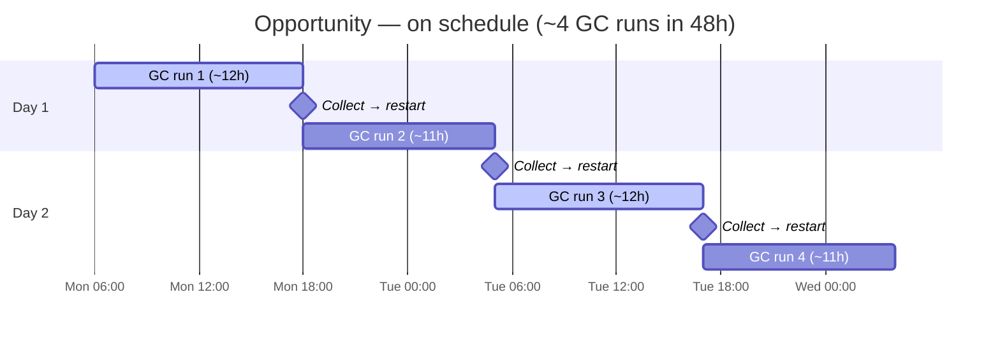
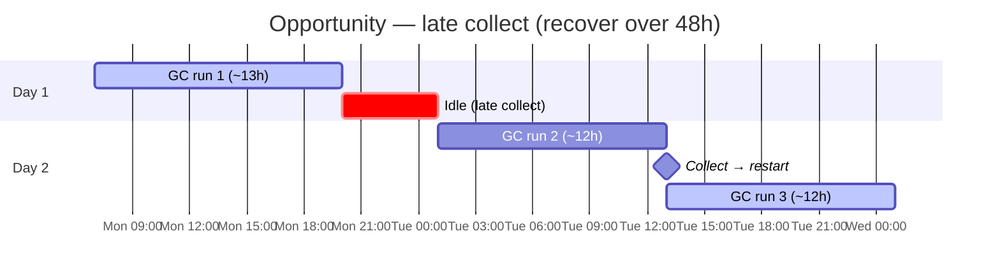
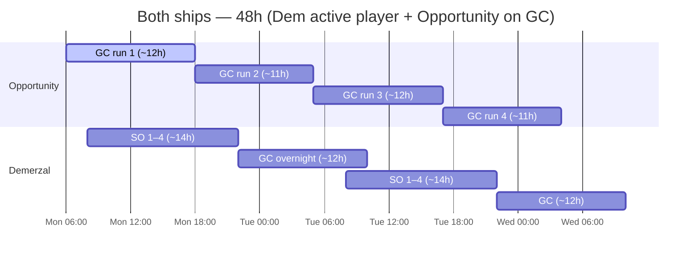

> **Machine translation (fr).** English source: [optimized-pattern.md](../../optimized-pattern.md). Report fixes in guild chat or a GitHub issue.

# Modèle commercial optimisé

Norme de guilde pour les expéditions commerciales **Opportunity** et **Demerzal (Dem)**.

---

## Règles de base

### Opportunité – Pièce Galactique uniquement

**L'opportunité ne devrait utiliser que Galactic Coin (GC).**

- Ne pas attribuer de commandes spéciales à l'opportunité
- **Le bonus de chargement de l'opportunité favorise GC** — utiliser exclusivement Galactic Coin est la manière privilégiée d'utiliser ce vaisseau
- Ce bonus de chargement **ne semble pas s'appliquer aux commandes spéciales** (tests en jeu jusqu'à présent), donc SO sur Opportunity gaspille le principal avantage du vaisseau
- Le jeu propose **3 fenêtres GC par jour** — chaque exécution dure **~11 à 13 heures**
- Une seule analyse GC peut occuper la majeure partie d'une journée d'éveil. Ne présumez pas que vous pouvez enchaîner trois analyses complètes en 24 heures.
- **Planifiez sur un horizon de 48 heures** — de manière réaliste **~1 à 2 courses terminées par jour**, **~3 à 4 sur 48 heures** si vous récupérez à temps
- Le travail de l'opportunité est **la disponibilité maximale du GC**, et non un débit sur commande spéciale

#### Pourquoi GC uniquement ?

L'opportunité a un **bonus de charge** lié à la quantité de marchandises que le navire transporte lors d'un trajet. Sur les routes Galactic Coin, ce bonus augmente considérablement les gains – la norme de guilde est donc **GC uniquement, toujours**, pour empiler le bonus de charge à chaque course.

Les commandes spéciales sur Opportunity représentent une double perte : vous manquez le bonus de chargement GC sur le navire construit pour cela, et **le bonus de chargement ne semble pas augmenter les récompenses des commandes spéciales** de toute façon. Passez des commandes spéciales sur Dem ; garder Opportunity sur GC.

*Si un correctif modifie la façon dont le bonus de chargement interagit avec les commandes spéciales, mettez à jour ce document.*

### Demerzal — Commandes spéciales, puis pièce galactique

**Dem exécute des commandes spéciales pendant votre fenêtre active, puis Galactic Coin.**

Deux modes valides :

| Mode | Quand | Modèle |
|------|------|--------------|
| **Journée active** | Vous vous enregistrez régulièrement | 4× commandes spéciales → GC run |
| **Veille / hors ligne** | Pour la nuit ou à l'extérieur | Pièce Galactique uniquement (identique à Opportunity inactive) |

Dem est le **navire en commande spéciale**. L'opportunité est le **navire GC**. N'échangez pas les rôles.

---

## Timing — commandes spéciales (Dem)

Dem dispose de **4 emplacements de commande spéciale** par cycle.

| Métrique | Valeur |
|--------|--------|
| Commandes spéciales par cycle | **4** |
| Temps par commande spéciale | **2h 30 – 4h** (varie selon la commande) |
| Tous les 4 dans une seule fenêtre | **~12 à 16 heures** au total |
| Course de pièces galactiques | **~11 à 13 heures** |

**La journée optimisée :** effectuez les 4 commandes spéciales dans une fenêtre active de 12 à 16 heures, puis démarrez une **exécution GC (~ 11 à 13 h)** avant de vous coucher ou avant votre prochain enregistrement.

---

## Exemples d'horaires

Ajustez les heures de début en fonction de votre fuseau horaire et de vos habitudes d'enregistrement.

### Dem — joueur actif (enregistrement ~ 3 fois par jour)

| Temps | Dém |
|------|-----|
| Matin | Commencer la commande spéciale 1 |
| Midi | Collecter → commande spéciale 2 (ou 2 + 3 si court) |
| Soirée | Collecter → commandes spéciales 3 + 4 |
| Avant de dormir | Démarrer **Galactic Coin** (~ 11 à 13 heures pendant la nuit) |

Réveillez-vous avec GC terminé ; recommencez le cycle de commande spéciale ou exécutez GC sur Opportunity.

### Dem – mode veille uniquement

Si vous ne touchez pas au jeu pendant plus de 8 heures :

- **Ignorer les commandes spéciales** — démarrez **Galactic Coin** sur Dem avant d'être hors ligne
- Reprenez le cycle de commande spéciale à votre retour pour une fenêtre de 12 à 16 heures

### Opportunité — 3 fenêtres, forfait 48 heures

Le jeu propose **3 fenêtres GC par jour calendaire**. Chaque exécution de Galactic Coin dure **~11 à 13 heures** – suffisamment longtemps pour que vous effectuiez habituellement **1 à 2 exécutions en 24 heures**, pas toutes les 3. Cible : **Opportunité toujours sur GC** ; collecter et redémarrer dès la fin de chaque exécution.

| Métrique | Valeur |
|--------|--------|
| Fenêtres GC par jour | **3** (machines à sous) |
| Longueur d'exécution GC | **~11 à 13 heures** |
| Réaliste par 24h | **~1 à 2 exécutions terminées** |
| Réaliste par 48h | **~3 à 4 exécutions terminées** (avec minuterie) |
| Horizon de planification | **48 heures** (deux jours complets) |

**Pourquoi 48 heures ?** À **11-13 heures par trajet**, une collecte tardive ou un long trajet peut anéantir votre prochaine fenêtre. Un plan d’une seule journée échoue rapidement. Regarder **deux jours à l'avance** indique quand vous vous enregistrerez, où les exécutions se chevauchent et quand vous devez redémarrer immédiatement pour éviter les temps d'inactivité.

### Délais de 48 heures

Les horaires sont indicatifs : modifiez votre fuseau horaire et vos habitudes d'enregistrement. Chaque bloc GC dure **~11-13h**.

#### Opportunité — dans les délais (~4 courses / 48h)

Collectez et redémarrez immédiatement après chaque exécution. Deux courses par jour calendaire lorsque le timing est serré.

#### Opportunité — collecte tardive (~ 2 à 3 exécutions / 48 h)

Une journée lente ; récupérez le jour 2 en redémarrant dès que le navire est libre — n'attendez pas un enregistrement « pratique ».

#### Les deux navires – Dem actif + Opportunité toujours GC

L’opportunité n’arrête jamais GC. Dem exécute des commandes spéciales pendant votre fenêtre active, puis GC pendant la nuit.

| Fenêtre | Opportunité |
|--------|-------------|
| Chacun des 3 créneaux GC quotidiens | **Galactic Coin** — redémarrez dès que l'exécution précédente est terminée |
| Jamais | Commandes spéciales |
| Lors de la planification | Marquez vos **2 prochains enregistrements** (48 h) — les courses durent de **11 à 13 h** chacune |

Si Dem exécute GC pendant la nuit, Opportunity devrait ** déjà être sur GC ** ou démarrer le prochain GC dès que le précédent est terminé - pas de temps d'inactivité sur aucun des navires GC.

---

## Objectif sur 24 heures (Dem) + objectif sur 48 heures (Opportunité)

**Dem** — un cycle actif par jour lorsque cela est possible (voir la chronologie des **Les deux navires** ci-dessus).

**Opportunité** — **~11 à 13 h par exécution** ; **~1 à 2 exécutions par 24 h**, **~3 à 4 sur 48 h** avec minuterie (voir les délais ci-dessus).

| Scénario | Courses / 24h | Courses / 48h |
|--------------|------------|------------|
| Dans les délais | ~2 | ~3–4 |
| Collecte tardive | ~1 | ~2–3 (récupération jour 2) |

**Commandes spéciales (SO)** = Dém seulement, pendant les heures actives.  
**Pièce Galactique (GC)** = Opportunité toujours (3× fenêtres quotidiennes) ; Dem comble les lacunes et du jour au lendemain.

---

## Liste de contrôle

### Opportunité
- [ ] Seule la pièce galactique attribuée - vérifiez avant chaque envoi
- [ ] Aucune commande spéciale sur ce navire, jamais
- [ ] Gardez Opportunity sur GC chaque fois qu'un emplacement est libre - **toujours en cours d'exécution, jamais inactif**
- [ ] Attendez-vous à **~1 à 2 exécutions terminées par jour** (~11 à 13 h chacune) ; prévoir **48 h** pour **~3 à 4 courses**
- [ ] Planifiez les enregistrements **48 heures à l'avance** — un retrait tardif vous coûte toute une fenêtre
- [ ] Récupérez le GC selon la minuterie ; redémarrer immédiatement : l'opportunité inactive est un gaspillage de débit

### Démerzal
- [ ] 4 commandes spéciales mises en file d'attente pendant une fenêtre active de 12 à 16 heures lorsque cela est possible
- [ ] Une fois la 4ème commande spéciale terminée → démarrez **GC (~11–13h)** avant la mise hors ligne
- [ ] Si vous dormez plus de 8 heures sans enregistrement → **GC uniquement**, ignorez les commandes spéciales
-[ ] Ne laissez jamais Dem inactif entre les exécutions si un emplacement est disponible

---

## Erreurs courantes

| Erreur | Corriger |
|---------|-----|
| Commandes spéciales sur Opportunité | Déplacez tous les SO vers Dem — Le bonus de charge Opp est pour **GC** et ne semble pas aider SO |
| Ils sont inactifs du jour au lendemain sans GC | Démarrez GC (~ 11-13h) avant de dormir |
| 3 exécutions complètes de GC attendues en une journée | Les courses durent **11-13h** — en réalité **1-2/jour**, **~3-4/48h** |
| Les exécutions GC supposées durent environ 8 à 10 heures | Les fenêtres sont de **11 à 13h** — replanification sur un horizon de 48h |
| Seulement 2 à 3 commandes spéciales par jour sur Dem | Planifiez une fenêtre de 12 à 16 heures pour les 4 |
| GC sur Dem pendant que vous êtes actif et que les emplacements SO sont ouverts | Exécutez SO en premier, GC en dernier dans la fenêtre |
| Les deux navires en commandes spéciales | Opp ne gère jamais SO – Dem les possède |

---

## Résumé

| Navire | Rôle | Modèle |
|------|------|--------------|
| **Opportunité** | Spécialiste GC | Pièce Galactique **uniquement** — **bonus de chargement sur GC** ; DONC ne semble pas en bénéficier |
| **Démerzal** | SO + GC flexibles | 4× commandes spéciales (12-16 h) → GC (~11-13h) ; ou GC pendant le sommeil |

---

*Les horaires sont approximatifs : confirmez les durées de jeu pour votre serveur et mettez à jour ce document si les correctifs modifient la durée d'exécution.*