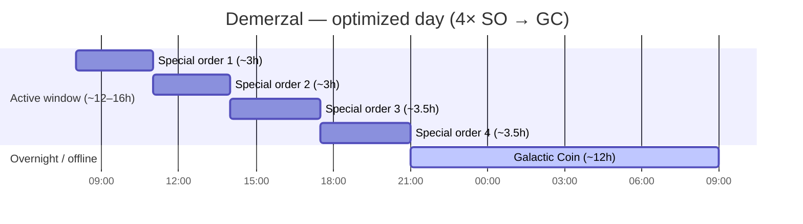
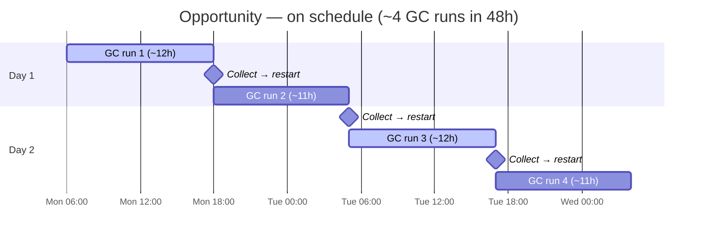
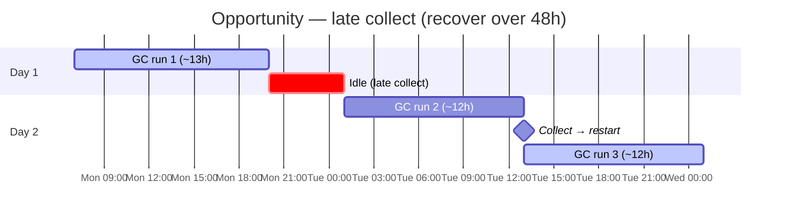
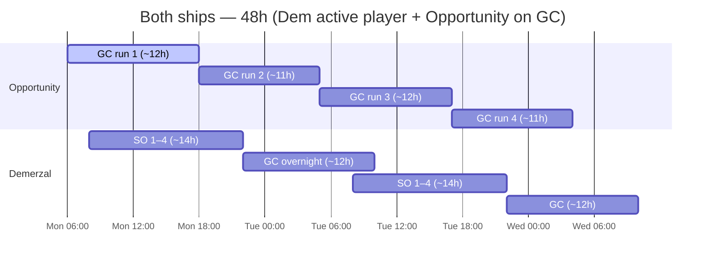

> **Machine translation (pt).** English source: [optimized-pattern.md](../../optimized-pattern.md). Report fixes in guild chat or a GitHub issue.

# Padrão comercial otimizado

Padrão da guilda para remessa comercial **Opportunity** e **Demerzal (Dem)**.

---

## Regras básicas

### Oportunidade — Somente Moeda Galáctica

**A oportunidade só deve rodar Galactic Coin (GC).**

- Não atribua pedidos especiais ao Opportunity
- O jogo oferece **3 janelas de GC por dia** — cada execução dura **~11–13 horas**
- Uma única execução de GC pode preencher a maior parte do dia – não presuma que você pode encadear três execuções completas em 24h
- **Planeje em um horizonte de 48 horas** — realisticamente **~1–2 corridas concluídas por dia**, **~3–4 em 48h** se você coletar no prazo
- A tarefa do Opportunity é **tempo máximo de atividade do GC**, não produção de pedido especial

### Demerzal – Pedidos especiais, depois Moeda Galáctica

**Dem executa pedidos especiais durante sua janela ativa e depois Galactic Coin.**

Dois modos válidos:

| Modo | Quando | Padrão |
|------|------|---------|
| **Dia ativo** | Você está fazendo check-in regularmente | 4× pedidos especiais → execução do GC |
| **Suspensão / off-line** | Pernoite ou fora | Somente moeda galáctica (igual à oportunidade ociosa) |

Dem é o **navio de pedido especial**. A oportunidade é o **navio GC**. Não troque de papéis.

---

## Prazo — pedidos especiais (Dem)

Dem tem **4 vagas para pedidos especiais** por ciclo.

| Métrica | Valor |
|--------|--------|
| Encomendas especiais por ciclo | **4** |
| Tempo por pedido especial | **2h30m – 4h** (varia conforme pedido) |
| Todos os 4 em uma janela | **~12–16 horas** total |
| Corrida de Moeda Galáctica | **~11–13 horas** |

**O dia otimizado:** coloque todos os 4 pedidos especiais dentro de uma janela ativa de 12 a 16 horas e, em seguida, inicie uma **execução de GC (~11 a 13h)** antes de dormir ou antes do próximo check-in.

---

## Exemplos de cronogramas

Ajuste os horários de início ao seu fuso horário e hábitos de check-in.

### Dem — jogador ativo (check-in ~3× dia)

| Tempo | Dem |
|------|-----|
| Manhã | Iniciar pedido especial 1 |
| Meio-dia | Coletar → pedido especial 2 (ou 2 + 3 se for curto) |
| Noite | Coletar → pedidos especiais 3 + 4 |
| Antes de dormir | Iniciar **Moeda Galáctica** (~11–13 horas durante a noite) |

Acorde com o GC concluído; inicie o ciclo de pedido especial novamente ou execute o GC no Opportunity.

### Dem — apenas modo de suspensão

Se você não tocar no jogo por mais de 8 horas:

- **Pular pedidos especiais** — inicie **Galactic Coin** no Dem antes de ficar offline
- Retomar o ciclo de pedidos especiais quando voltar para um período de 12 a 16 horas

### Oportunidade — 3 janelas, plano de 48 horas

O jogo oferece **3 janelas de GC por dia**. Cada execução da Moeda Galáctica dura **~11–13 horas** — tempo suficiente para que você normalmente conclua **1–2 execuções em 24h**, não todas as 3. Alvo: **Oportunidade sempre no GC**; colete e reinicie no momento em que cada corrida terminar.

| Métrica | Valor |
|--------|--------|
| Janelas de GC por dia | **3** (slots de jogos) |
| Comprimento da execução do GC | **~11–13 horas** |
| Realista por 24h | **~1–2 execuções concluídas** |
| Realista por 48h | **~3–4 execuções concluídas** (no cronômetro) |
| Horizonte de planejamento | **48 horas** (dois dias completos) |

**Por que 48 horas?** Às **11–13h por corrida**, uma coleta tardia ou um percurso longo pode acabar com sua próxima janela. Um plano de um dia quebra rapidamente. A previsão de **dois dias de antecedência** mostra quando você fará o check-in, onde as execuções se sobrepõem e quando você deve reiniciar imediatamente para evitar tempo ocioso.

### Cronogramas de 48 horas

Os horários são ilustrativos – mude de acordo com seu fuso horário e hábitos de check-in. Cada bloco de GC dura **~11–13h**.

#### Oportunidade — dentro do prazo (~4 execuções/48h)

Colete e reinicie imediatamente após cada execução. Duas corridas por dia quando o tempo é apertado.

#### Oportunidade — coleta tardia (~2–3 execuções/48h)

Um dia lento; recupere-se no Dia 2 reiniciando no momento em que o navio estiver livre – não espere por um check-in “conveniente”.

#### Ambos os navios — Dem ativo + Oportunidade sempre GC

A oportunidade nunca para o GC. Dem executa pedidos especiais durante sua janela ativa e depois GC durante a noite.

| Janela | Oportunidade |
|--------|------------|
| Cada um dos 3 slots diários de GC | **Moeda Galáctica** — reinicie assim que a execução anterior for concluída |
| Nunca | Encomendas especiais |
| Ao planejar | Marque seus próximos **2 check-ins** (48h) — as corridas duram **11–13h** cada |

Se Dem estiver executando o GC durante a noite, o Opportunity **já deverá estar no GC** ou iniciar o próximo GC assim que o anterior for concluído - sem tempo ocioso em nenhum dos navios do GC.

---

## meta de 24 horas (Dem) + meta de 48 horas (oportunidade)

**Dem** — um ciclo ativo por dia, quando possível (veja o cronograma de **Ambos os navios** acima).

**Oportunidade** — **~11–13h por corrida**; **~1–2 execuções por 24h**, **~3–4 durante 48h** no cronômetro (veja os cronogramas acima).

| Cenário | Corridas / 24h | Corridas / 48h |
|----------|------------|------------|
| Dentro do cronograma | ~2 | ~3–4 |
| Cobrança tardia | ~1 | ~2–3 (recuperação do dia 2) |

**Pedidos especiais (SO)** = Somente Dem, durante o horário ativo.  
**Moeda Galáctica (GC)** = Oportunidade sempre (3× janelas diárias); Dem preenche lacunas da noite para o dia.

---

## Lista de verificação

### Oportunidade
- [] Apenas Moeda Galáctica atribuída - verifique antes de cada despedida
- [] Nenhum pedido especial neste navio, nunca
- [] Mantenha o Opportunity no GC sempre que um slot estiver livre — **sempre em execução, nunca ocioso**
- [ ] Espere **~1–2 execuções concluídas por dia** (~11–13h cada); planeje **48h** para **~3–4 corridas**
- [ ] Planeje check-ins **48 horas antes** — uma coleta tardia custa uma janela inteira
- [] Coleta GC no cronômetro; reinicie imediatamente – ocioso. Oportunidade é desperdício de rendimento

### Demerzal
- [] 4 pedidos especiais na fila durante a janela ativa de 12 a 16 horas, quando possível
- [ ] Após a conclusão do 4º pedido especial → iniciar **GC (~11–13h)** antes de ficar off-line
- [ ] Se dormir mais de 8 horas sem check-ins → **Somente GC**, ignore pedidos especiais
- [] Nunca deixe Dem ocioso entre as execuções se um slot estiver disponível

---

## Erros comuns

| Erro | Correção |
|--------|-----|
| Pedidos especiais no Opportunity | Mova todos os SO para Dem; Opp = somente GC |
| Dem ocioso durante a noite sem GC | Inicie o GC (~11–13h) antes de dormir |
| Esperadas 3 execuções completas de GC em um dia | As corridas são **11–13h** – realisticamente **1–2/dia**, **~3–4/48h** |
| As execuções presumidas do GC são de aproximadamente 8–10h | As janelas são **11–13h** — replanejar em um horizonte de 48h |
| Apenas 2–3 pedidos especiais por dia no Dem | Planeje uma janela de 12 a 16 horas para todos os 4 |
| GC on Dem enquanto você está ativo e slots SO abertos | Execute o SO primeiro, o GC por último na janela |
| Ambos os navios sob encomenda especial | Opp nunca administra SO – Dem é o dono deles |

---

## Resumo

| Navio | Função | Padrão |
|------|------|---------|
| **Oportunidade** | Especialista em GC | Moeda Galáctica **apenas** — **~11–13h corridas**, **~1–2/dia**, plano **48h** (~3–4 corridas) |
| **Demerzal** | SO + GC flexível | 4× pedidos especiais (12–16h) → GC (~11–13h); ou GC enquanto dorme |

---

*Os tempos são aproximados – confirme a duração do jogo para o seu servidor e atualize este documento se os patches mudarem a duração da execução.*