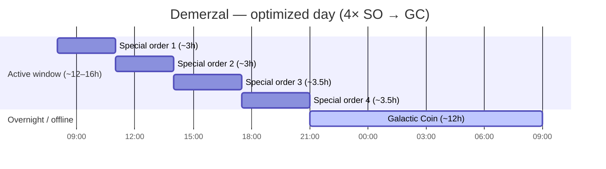
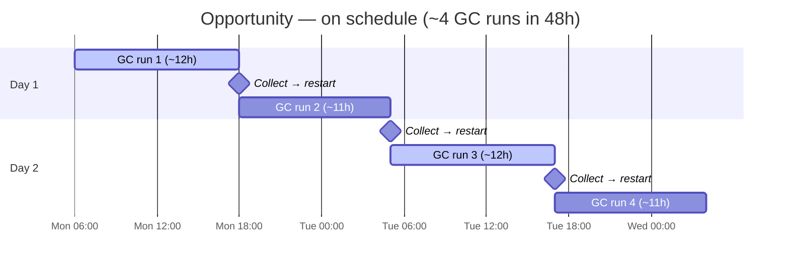
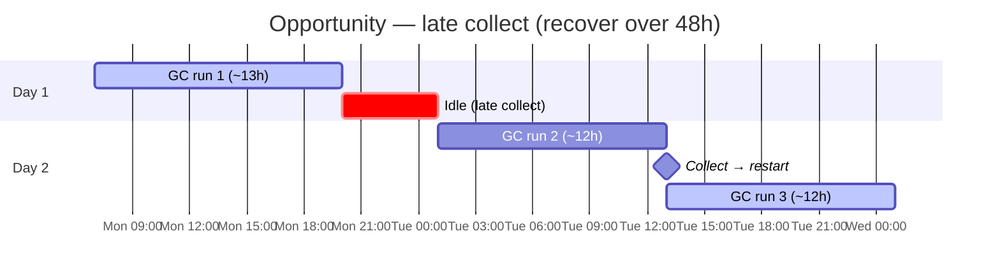
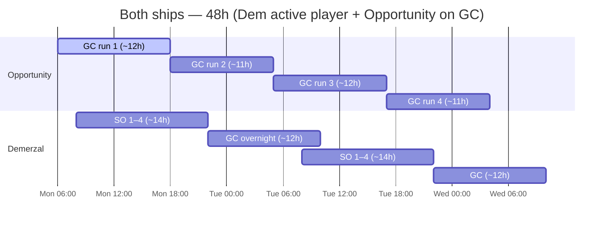

> **Machine translation (ru).** English source: [optimized-pattern.md](../../optimized-pattern.md). Report fixes in guild chat or a GitHub issue.

# Оптимизированная модель торговли

Стандарт гильдии для торговых перевозок **Opportunity** и **Demerzal (Dem)**.

---

## Основные правила

### Возможность — только Галактическая монета

**В Opportunity следует использовать только Galactic Coin (GC).**

- Не назначайте специальные заказы Opportunity.
- В игре **3 окна GC в день** — каждое прохождение длится **~11–13 часов**
- Один прогон ГХ может занять большую часть дня бодрствования — не думайте, что вы сможете связать три полных прогона за 24 часа.
- **Планируйте на 48 часов** — реалистично **~1–2 выполненных пробега в день**, **~3–4 за 48 часов**, если вы соберетесь вовремя.
– Задача Opportunity — **максимальное время безотказной работы GC**, а не пропускная способность по специальному заказу.

### Демерзал — Особые заказы, затем Галактическая монета

**Dem выполняет специальные заказы во время вашего активного окна, а затем Galactic Coin.**

Два действующих режима:

| Режим | Когда | Узор |
|------|------|---------|
| **Активный день** | Вы регулярно заходите | 4× специальные заказы → Прогон GC |
| **Сон/офлайн** | Ночью или в гостях | Только Галактические монеты (то же самое, что и «Возможность в режиме ожидания») |

«Дем» — **корабль специального заказа**. Opportunity — это **корабль GC**. Не меняйтесь ролями.

---

## Сроки — специальные заказы (дем)

У Dem есть **4 слота для специальных заказов** за цикл.

| Метрическая | Значение |
|--------|--------|
| Специальные заказы за цикл | **4** |
| Время на специальный заказ | **2ч 30м – 4ч** (зависит от заказа) |
| Все 4 в одном окне | **~12–16 часов** всего |
| Галактический забег монет | **~11–13 часов** |

**Оптимизированный день**: уместите все 4 специальных заказа в активный период продолжительностью 12–16 часов, а затем начните **пробег GC (~11–13 часов)** перед сном или перед следующей регистрацией заезда.

---

## Примеры расписаний

Настройте время начала в соответствии со своим часовым поясом и привычками регистрации.

### Dem — активный игрок (заезд ~3 раза в день)

| Время | Дем |
|------|-----|
| Утро | Начать специальный заказ 1 |
| Полдень | Собрать → специальный заказ 2 (или 2 + 3, если мало) |
| Вечер | Собрать → специальные заказы 3 + 4 |
| Перед сном | Старт **Галактической монеты** (около 11–13 часов ночью) |

Просыпайтесь после завершения GC; снова запустите цикл специального заказа или запустите GC при возможности.

### Dem — только спящий режим

Если вы не будете трогать игру более 8 часов:

- **Пропустить специальные заказы** — запустите **Галактическую монету** на Dem перед отключением от сети.
- Возобновите цикл выполнения специальных заказов, когда вернетесь на 12–16 часов.

### Возможность — 3 окна, план на 48 часов

В игре предусмотрено **3 окна GC за календарный день**. Каждый запуск Galactic Coin длится **~11–13 часов** — достаточно долго, чтобы вы обычно выполняли **1–2 запуска за 24 часа**, а не все 3. Цель: **Возможность всегда на GC**; соберите и перезапустите момент завершения каждого запуска.

| Метрическая | Значение |
|--------|--------|
| Окна GC в день | **3** (игровые автоматы) |
| Длина пробега GC | **~11–13 часов** |
| Реалистично за 24 часа | **~1–2 завершенных запуска** |
| Реалистично за 48 часов | **~3–4 завершенных запуска** (по таймеру) |
| Горизонт планирования | **48 часов** (два полных дня) |

**Почему 48 часов?** При **11–13 часах за заезд** один поздний сбор или один длинный маршрут могут стереть ваше следующее окно. Однодневный план быстро ломается. Просмотр **на два дня вперед** показывает, когда вы зарегистрируетесь, где пробеги пересекаются и когда вам необходимо немедленно возобновить работу, чтобы избежать простоя.

### 48-часовые сроки

Времена приведены для наглядности — перейдите к своему часовому поясу и привычкам отмечаться. Каждый блок GC длится **~11–13 часов**.

#### Возможность — по расписанию (~4 захода/48 часов)

Собирайте и перезапускайте сразу после каждого запуска. Два заезда в календарный день, когда время ограничено.

#### Возможность — поздний сбор (~2–3 заезда/48 часов)

Один медленный день; восстановиться на День 2, перезапустив момент, когда корабль освободится — не ждите «удобного» заселения.

#### Оба корабля — Дем активен + Возможность всегда GC

Возможность никогда не останавливает GC. Dem выполняет специальные заказы в течение вашего активного окна, а затем GC в ночное время.

| Окно | Возможность |
|--------|-------------|
| Каждый из 3-х ежедневных слотов GC | **Галактическая монета** — перезапустите, как только завершится предыдущий запуск |
| Никогда | Специальные заказы |
| При планировании | Отметьте следующие **2 заезда** (48 часов) — пробег длится **11–13 часов** каждый |

Если Дем запускает сборщик мусора на ночь, Opportunity должен **уже находиться на сборщике мусора** или начинать следующий сборщик мусора, как только завершится предыдущий — без простоя ни на одном из кораблей сборщика мусора.

---

## 24-часовая цель (демократия) + 48-часовая цель (возможность)

**Dem** — один активный цикл в день, если это возможно (см. график **Оба корабля** выше).

**Возможность** — **~11–13 часов за забег**; **~1–2 захода в сутки**, **~3–4 за 48 часов** по таймеру (см. график выше).

| Сценарий | Пробежки / 24 часа | Пробежки / 48 часов |
|----------|------------|------------|
| По расписанию | ~2 | ~3–4 |
| Поздно собирать | ~1 | ~2–3 (восстановление, День 2) |

**Специальные заказы (SO)** = только Dem, в активные часы.  
**Галактическая монета (GC)** = Возможность всегда (3 ежедневных окна); Дем заполняет пробелы и в одночасье.

---

## Контрольный список

### Возможность
- [ ] Назначены только галактические монеты — проверяйте перед каждой отправкой
- [ ] Никаких особых заказов на этом корабле никогда не было.
- [ ] Сохраняйте Opportunity на GC всякий раз, когда слот свободен — **всегда работает, никогда не простаивает**
- [ ] Ожидайте **~1–2 завершенных пробега в день** (~11–13 часов каждый); планируйте **48 часов** на **~3–4 захода**
- [ ] Планируйте заезды **на 48 часов вперед** — один поздний сбор будет стоить вам целого окна
- [ ] Сбор GC по таймеру; Немедленный перезапуск — бездействие. Возможность теряет пропускную способность.

### Демерзал
- [ ] 4 специальных заказа в очереди в течение 12–16 часов активного окна, если это возможно.
- [ ] После выполнения 4-го специального заказа → запустите **GC (~11–13 часов)** перед отключением от сети.
- [ ] Если спите более 8 часов без регистрации → **только GC**, пропустите специальные заказы
- [ ] Никогда не оставляйте Dem бездействующим между запусками, если слот доступен.

---

## Распространенные ошибки

| Ошибка | Исправить |
|---------|-----|
| Специальные заказы на возможности | Переместите все SO в Dem; Opp = только GC |
| Дем простаивает ночь без GC | Запуск GC (~11–13 часов) перед сном |
| Ожидается 3 полных запуска GC за один день | Пробежки составляют **11–13 часов** — реально **1–2 в день**, **~3–4/48 часов** |
| Предполагаемая продолжительность работы ГХ составляет ~8–10 часов | Окна **11–13 часов** — перепланируйте на горизонте 48 часов |
| Всего 2–3 специальных заказа в день на Dem | Запланируйте окно на 12–16 часов для всех 4 |
| GC на Dem, пока вы активны и слоты SO открыты | Сначала запустите SO, затем GC в окне |
| Оба корабля по специальному заказу | Опп никогда не управляет SO — они принадлежат Дему |

---

## Резюме

| Корабль | Роль | Узор |
|------|------|---------|
| **Возможность** | Специалист по ГХ | Galactic Coin **только** — **~11–13 часов**, **~1–2 в день**, план **48 часов** (~3–4 захода) |
| **Демерзал** | SO + GC гибкий | 4× особых заказа (12–16 часов) → GC (~11–13 часов); или GC во время сна |

---

*Время приблизительное — подтвердите продолжительность игры на вашем сервере и обновите этот документ, если патчи изменят продолжительность запуска.*