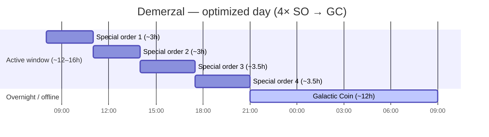
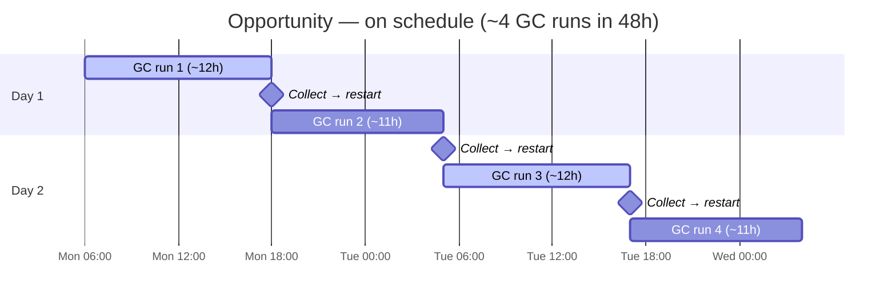
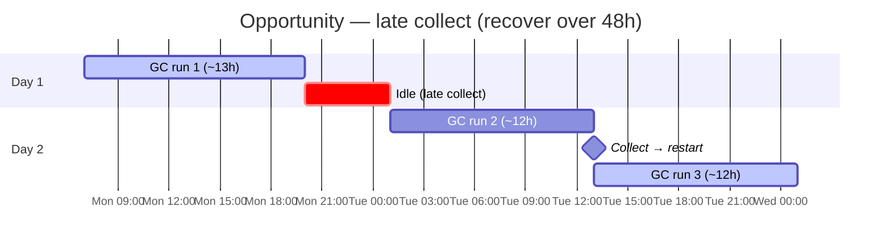
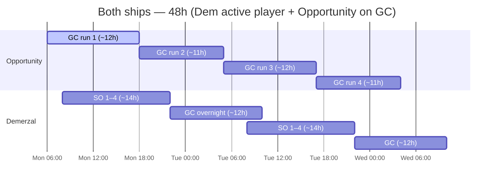

# Optimized Trade Pattern

Guild standard for **Opportunity** and **Demerzal (Dem)** trade shipping.

---

## Core rules

### Opportunity — Galactic Coin only

**Opportunity should only ever run Galactic Coin (GC).**

- Do not assign special orders to Opportunity
- **Opportunity’s load bonus favors GC** — running Galactic Coin exclusively is the preferred way to use this ship
- That load bonus **does not appear to apply to special orders** (in-game testing so far), so SO on Opportunity wastes the ship’s main advantage
- The game offers **3 GC windows per day** — each run lasts **~11–13 hours**
- A single GC run can fill most of a waking day — don't assume you can chain three full runs in 24h
- **Plan on a 48-hour horizon** — realistically **~1–2 completed runs per day**, **~3–4 over 48h** if you collect on time
- Opportunity's job is **maximum GC uptime**, not special-order throughput

#### Why GC only?

Opportunity has a **load bonus** tied to how much cargo the ship carries on a run. On Galactic Coin routes, that bonus meaningfully increases payout — so the guild standard is **GC only, always**, to stack load bonus on every run.

Special orders on Opportunity are a double loss: you miss the GC load bonus on the ship built for it, and **the load bonus doesn’t seem to boost special-order rewards** anyway. Put special orders on Dem; keep Opportunity on GC.

*If a patch changes how load bonus interacts with special orders, update this doc.*

### Demerzal — Special orders, then Galactic Coin

**Dem runs special orders during your active window, then Galactic Coin.**

Two valid modes:

| Mode | When | Pattern |
|------|------|---------|
| **Active day** | You're checking in regularly | 4× special orders → GC run |
| **Sleep / offline** | Overnight or away | Galactic Coin only (same as Opportunity idle) |

Dem is the **special-order ship**. Opportunity is the **GC ship**. Don't swap roles.

---

## Timing — special orders (Dem)

Dem has **4 special order slots** per cycle.

| Metric | Value |
|--------|--------|
| Special orders per cycle | **4** |
| Time per special order | **2h 30m – 4h** (varies by order) |
| All 4 in one window | **~12–16 hours** total |
| Galactic Coin run | **~11–13 hours** |

**The optimized day:** fit all 4 special orders inside a 12–16 hour active window, then start a **GC run (~11–13h)** before bed or before your next check-in.

---

## Sample schedules

Adjust start times to your timezone and check-in habits.

### Dem — active player (check in ~3× day)

| Time | Dem |
|------|-----|
| Morning | Start special order 1 |
| Midday | Collect → special order 2 (or 2 + 3 if short) |
| Evening | Collect → special orders 3 + 4 |
| Before sleep | Start **Galactic Coin** (~11–13 hr overnight) |

Wake up to GC complete; start special order cycle again or run GC on Opportunity.

### Dem — sleep mode only

If you won't touch the game for 8+ hours:

- **Skip special orders** — start **Galactic Coin** on Dem before offline
- Resume special-order cycle when you're back for a 12–16 hr window

### Opportunity — 3 windows, 48-hour plan

The game offers **3 GC windows per calendar day**. Each Galactic Coin run lasts **~11–13 hours** — long enough that you usually complete **1–2 runs in 24h**, not all 3. Target: **Opportunity always on GC**; collect and restart the moment each run finishes.

| Metric | Value |
|--------|--------|
| GC windows per day | **3** (game slots) |
| GC run length | **~11–13 hours** |
| Realistic per 24h | **~1–2 completed runs** |
| Realistic per 48h | **~3–4 completed runs** (on timer) |
| Planning horizon | **48 hours** (two full days) |

**Why 48 hours?** At **11–13h per run**, one late collection or one long route can wipe out your next window. A single-day plan breaks fast. Looking **two days ahead** shows when you'll check in, where runs overlap, and when you must restart immediately to avoid idle time.

### 48-hour timelines

Times are illustrative — shift to your timezone and check-in habits. Each GC block is **~11–13h**.

#### Opportunity — on schedule (~4 runs / 48h)

Collect and restart immediately after each run. Two runs per calendar day when timing is tight.

#### Opportunity — late collect (~2–3 runs / 48h)

One slow day; recover on Day 2 by restarting the moment the ship is free — don't wait for a "convenient" check-in.

#### Both ships — Dem active + Opportunity always GC

Opportunity never stops GC. Dem runs special orders during your active window, then GC overnight.

| Window | Opportunity |
|--------|-------------|
| Each of 3 daily GC slots | **Galactic Coin** — restart as soon as the previous run completes |
| Never | Special orders |
| When planning | Mark your next **2 check-ins** (48h) — runs are **11–13h** each |

If Dem is running GC overnight, Opportunity should **already be on GC** or starting the next GC as soon as the previous completes — no idle time on either GC ship.

---

## 24-hour target (Dem) + 48-hour target (Opportunity)

**Dem** — one active cycle per day when possible (see the **Both ships** timeline above).

**Opportunity** — **~11–13h per run**; **~1–2 runs per 24h**, **~3–4 over 48h** on timer (see timelines above).

| Scenario | Runs / 24h | Runs / 48h |
|----------|------------|------------|
| On schedule | ~2 | ~3–4 |
| Late collect | ~1 | ~2–3 (recover Day 2) |

**Special orders (SO)** = Dem only, during active hours.  
**Galactic Coin (GC)** = Opportunity always (3× daily windows); Dem fills gaps and overnight.

---

## Checklist

### Opportunity
- [ ] Only Galactic Coin assigned — verify before every send-off
- [ ] No special orders on this ship, ever
- [ ] Keep Opportunity on GC whenever a slot is free — **always running, never idle**
- [ ] Expect **~1–2 completed runs per day** (~11–13h each); plan **48h** for **~3–4 runs**
- [ ] Plan check-ins **48 hours ahead** — one late collect costs you a whole window
- [ ] Collect GC on timer; restart immediately — idle Opportunity is wasted throughput

### Demerzal
- [ ] 4 special orders queued during 12–16 hr active window when possible
- [ ] After 4th special order completes → start **GC (~11–13h)** before offline
- [ ] If sleeping 8+ hr with no check-ins → **GC only**, skip special orders
- [ ] Never leave Dem idle between runs if a slot is available

---

## Common mistakes

| Mistake | Fix |
|---------|-----|
| Special orders on Opportunity | Move all SO to Dem — Opp load bonus is for **GC**, and doesn’t seem to help SO |
| Dem idle overnight with no GC | Start GC (~11–13h) before sleep |
| Expected 3 full GC runs in one day | Runs are **11–13h** — realistically **1–2/day**, **~3–4/48h** |
| Assumed GC runs are ~8–10h | Windows are **11–13h** — replan on a 48h horizon |
| Only 2–3 special orders per day on Dem | Plan a 12–16 hr window for all 4 |
| GC on Dem while you're active and SO slots open | Run SO first, GC last in window |
| Both ships on special orders | Opp never runs SO — Dem owns them |

---

## Summary

| Ship | Role | Pattern |
|------|------|---------|
| **Opportunity** | GC specialist | Galactic Coin **only** — **load bonus on GC**; SO don’t appear to benefit |
| **Demerzal** | SO + GC flex | 4× special orders (12–16 hr) → GC (~11–13h); or GC while sleeping |

---

*Timings are approximate — confirm in-game durations for your server and update this doc if patches change run lengths.*
